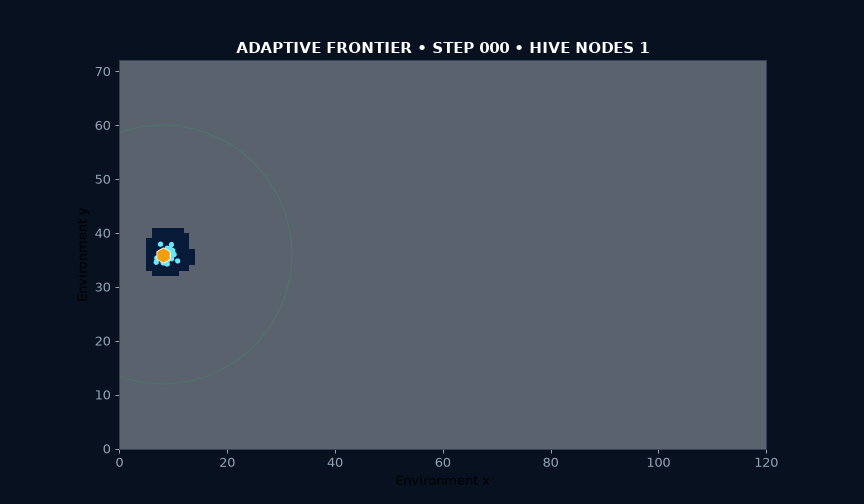
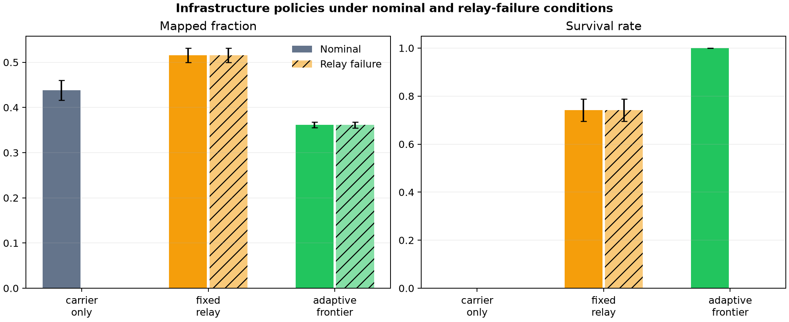

# Distributed Drone Hive

**What changes when swarm endurance belongs to persistent infrastructure instead of individual batteries?**

Distributed Drone Hive is a simulation-first research laboratory for infrastructure-driven swarm robotics. A carrier seeds an environment with energy-and-communication hives; low-power drones explore locally; relay topology determines which energy fields remain usable. Stage One turns the Drone Hive Systems concept into an executable comparison of carrier-only, fixed-relay, and adaptive-frontier deployment.



[Methods](docs/METHODS.md) · [Architecture](docs/ARCHITECTURE.md) · [Evidence](docs/EVIDENCE.md) · [Safety](docs/SAFETY.md) · [Roadmap](docs/ROADMAP.md) · [Baseline results](results/stage_one_baseline/README.md)

## What is implemented

| System element | Stage One implementation |
|---|---|
| Carrier unit | Root energy and communication anchor |
| Hive nodes | Deployable radial energy fields and graph-connected relays |
| Micro-drone swarm | Decentralized agents balancing unexplored space against energy safety |
| Infrastructure policy | Carrier-only control, fixed relays, and adaptive frontier placement |
| Robustness test | Nominal operation and loss of the first deployed relay |
| Evidence pipeline | Per-step telemetry, run summaries, aggregate statistics, manifests, and charts |

## Run the experiment

```bash
python -m venv .venv
source .venv/bin/activate  # Windows: .venv\Scripts\activate
pip install -e ".[dev]"
python -m drone_hive.cli
```

For a fast pipeline check:

```bash
python -m drone_hive.cli --quick
```

Every run creates a timestamped evidence bundle containing:

```text
manifest.json                    configuration, environment, and claim boundary
step_metrics.csv                 time-step telemetry for every condition
run_summary.csv                  one final record per policy, seed, and scenario
aggregate_summary.csv            means and sample standard deviations
policy_comparison.png            coverage and survival comparison
exploration_trajectories.png     five-seed progression curves
```

## One-click laboratory

```bash
python -m drone_hive.dashboard
```

The desktop dashboard runs and exports the complete policy × seed × failure matrix without requiring users to remember a command sequence. It exposes seed, duration, and swarm-size controls and opens the latest evidence directory directly.

## Frozen Stage One result

Across five seeds and 240 steps, the fixed-relay policy mapped 51.6% of the environment while retaining 74.2% of drones. The carrier-only control mapped 43.8% but ended with no active drones. Adaptive-frontier placement retained every drone in nominal operation while mapping 36.2%; loss of its first relay disconnected the chain and collapsed survival. That is a useful negative result: adaptive placement preserved energy but produced a brittle topology in the current configuration.



Read the [complete baseline interpretation](results/stage_one_baseline/README.md).

## Scientific and safety boundary

This repository validates a dimensionless computational model and an auditable experimental pipeline. It does **not** demonstrate physical RF/microwave power transfer, flight dynamics, antenna efficiency, thermal safety, collision avoidance, or regulatory compliance. No physical drones are controlled by this code. See [Safety](docs/SAFETY.md) before proposing hardware work.

## Development

```bash
ruff check .
pytest -q
python -m drone_hive.demo
```

CI tests Python 3.10 and 3.12, runs all unit tests, executes a smoke experiment, and uploads the resulting evidence bundle.

## Relationship to Decentralized Swarm Emergence

The swarm project studies reward-driven coordination under communication constraints. Drone Hive Systems extends that research into energy-and-communication infrastructure: energy availability becomes an environmental coordination signal, and the topology constructed by the swarm becomes part of the experimental outcome.

## Citation and license

See [CITATION.cff](CITATION.cff). Code is released under the [MIT License](LICENSE).
