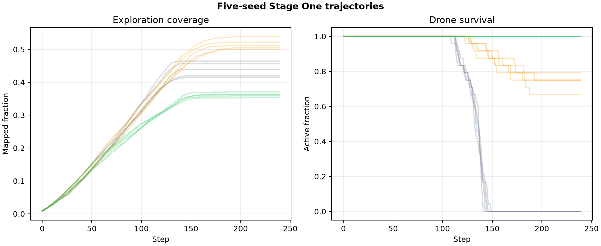

# Frozen Stage One baseline

[← Project home](../../README.md) · [Methods](../../docs/METHODS.md) · [Evidence guide](../../docs/EVIDENCE.md) · [Roadmap](../../docs/ROADMAP.md)

This bundle is the first frozen computational baseline for Distributed Drone Hive. It contains five independent seeds, 240 steps per run, 24 drones, three deployment policies, and relay-failure tests for the two policies that deploy relays.

## Aggregate outcomes

| Policy | Scenario | Mapped area | Drone survival | Mean final energy | Connected hives |
|---|---|---:|---:|---:|---:|
| Carrier only | Nominal | 43.84% | 0.00% | 0.00 | 100.00% |
| Fixed relay | Nominal | 51.58% | 74.17% | 31.71 | 100.00% |
| Fixed relay | First-relay failure | 51.58% | 74.17% | 31.71 | 83.33% |
| Adaptive frontier | Nominal | 36.16% | 100.00% | 32.00 | 100.00% |
| Adaptive frontier | First-relay failure | 36.14% | 0.00% | 0.00 | 20.00% |

## Interpretation

Fixed relays produced the highest mapped fraction and preserved most drones. Their overlapping topology tolerated loss of the first deployed relay without reducing final coverage or survival in this configuration. Adaptive-frontier placement maximized nominal survival but explored less area; its sparse chain was critically vulnerable to the tested relay loss. Carrier-only exploration reached substantial depth but exhausted every drone by the final step.

These outcomes reject any current claim that the implemented adaptive policy is universally superior. They identify a concrete next experiment: constrain adaptive placement using redundant-connectivity requirements, then compare it against the frozen policy without changing the held-out evaluation seeds.

## Audit files

- [Aggregate summary](aggregate_summary.csv)
- [Per-run summary](run_summary.csv)
- [Step-level telemetry](step_metrics.csv)
- [Reproducibility manifest](manifest.json)

## Claim boundary

All observations come from a dimensionless two-dimensional simulator. They validate deterministic execution, evidence generation, and policy behavior inside the implemented abstraction. They do not establish feasible wireless-power range, physical endurance, real-world safety, or superiority in a deployed robotic system.
